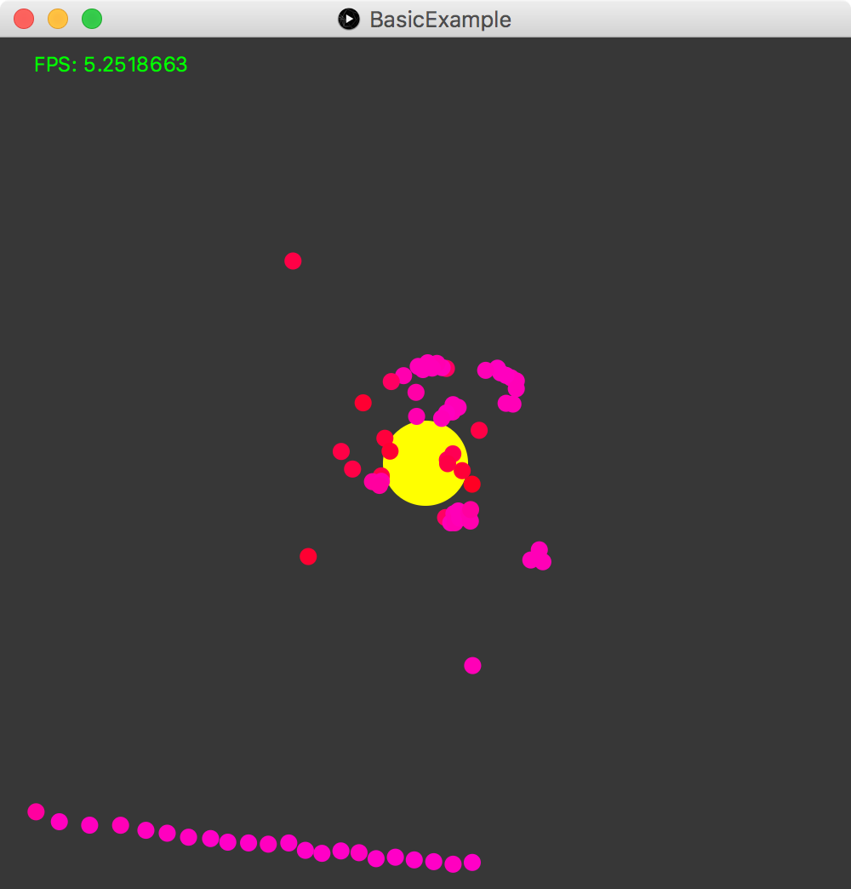

# Sweep for Processing   
Use the scanse sweep lidar with processing.

## Introduction

**Sweep for Processing** is a port of the **[Scanse](http://scanse.io/) Sweep LIDAR** library for processing. It gives you full access to the C API and adds some processing specfic methods to it.

Currently it is still under development and is **ONLY** tested on MacOS.

*Example of the LIDAR with FX2D*